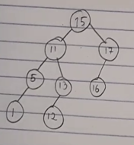

# Level Order Traversal of a Binary Tree

This code covers how the do a level order traversal of a binary tree. To accomplish this, we use the help of a queue.

## Structure

1. queue.c: Contains the implementation for Queue and Node
2. level_order_traversal_of_binary_tree.c: Contains the main() that does the level order traversal of the binary tree shown in [sample_binary_tree.png](sample_binary_tree.png).



## How to run the code (on Linux/Mac, use GitBash for Windows)

To compile the code
```
gcc -o ./executables/level_order_traversal_of_binary_tree level_order_traversal_of_binary_tree.c
```

To run the code
```
./executables/level_order_traversal_of_binary_tree
```

## Sample Output
```
$ ./executables/level_order_traversal_of_binary_trees.exe
Binary tree in level order: 15 11 17 5 13 16 1 12
```